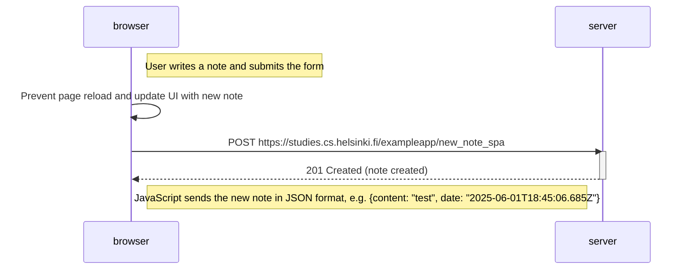

```mermaid
sequenceDiagram
    participant browser
    participant server

    Note right of browser: User writes a note and submits the form

    browser->>browser: Prevent page reload and update UI with new note
    browser->>server: POST https://studies.cs.helsinki.fi/exampleapp/new_note_spa
    activate server
    server-->>browser: 201 Created (note created)
    deactivate server

    Note right of browser: JavaScript sends the new note in JSON format, e.g. {content: "test", date: "2025-06-01T18:45:06.685Z"}
```